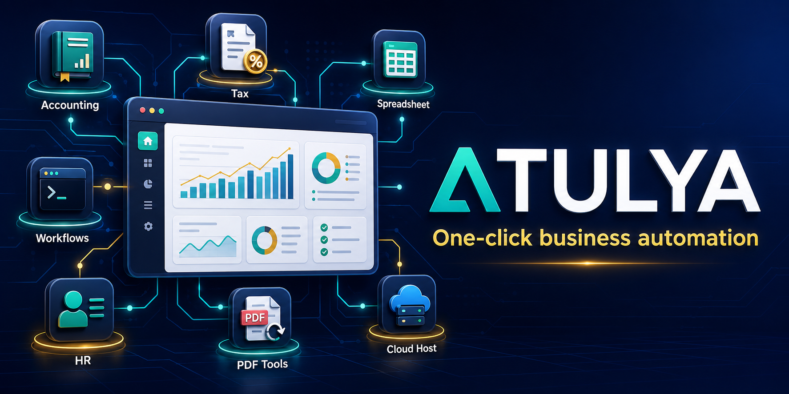

# Atulya Convert

> **Private offline conversion for daily documents, scans and business files.** 📄📱

Atulya Convert is planned as a free converter for phone and desktop users who want practical PDF, scan, image and structured-data tools without uploading private files to a remote conversion service.

> 🚧 This README is the product roadmap. Format fidelity and supported conversions will be documented only as they are tested.

## 📱 First Useful Toolbox

| Category | Planned tools |
|---|---|
| PDF | Merge, split, reorder, compress, watermark and sign |
| Scan | Camera scan, crop, cleanup, OCR and searchable PDF |
| Images | Resize, compress and convert JPG/PNG/WebP |
| Data | Excel/CSV/JSON conversion for practical business data |
| Business capture | Invoice/receipt image to reviewable spreadsheet fields |
| Sharing | Export locally and hand off to Atulya Invoice or DataClean |

## 🏗️ Architecture

## 💻 Delivery Plan

| Platform | Experience |
|---|---|
| Android | Offline-first application for scan, PDF and quick conversion |
| Windows / macOS / Linux | Drag-and-drop desktop conversion queue |
| Atulya One | Embedded conversion and document capture services |

## 🗺️ Roadmap

| Phase | Delivery |
|---|---|
| 1 | Image-to-PDF, PDF merge/split and image compression |
| 2 | OCR scans and searchable document export |
| 3 | CSV/Excel/JSON conversions and batch work |
| 4 | Invoice/receipt capture with review screen |
| 5 | Desktop/mobile sync through user-controlled storage |

## 🔒 Privacy Promise

Offline conversion is the default design goal. Any optional cloud or AI processing must be clearly disclosed and opt-in.

## 🔗 Ecosystem

[Atulya Invoice](https://github.com/atulyaai/Atulya-Invoice) · [Atulya DataClean](https://github.com/atulyaai/Atulya-Data-Scruber) · [Atulya Office](https://github.com/atulyaai/Atulya-Office) · [Atulya One](https://github.com/atulyaai/Atulya-Automation-Hub)

## 📜 License

MIT planned for Atulya-authored source; bundled converter dependencies retain their licenses.
