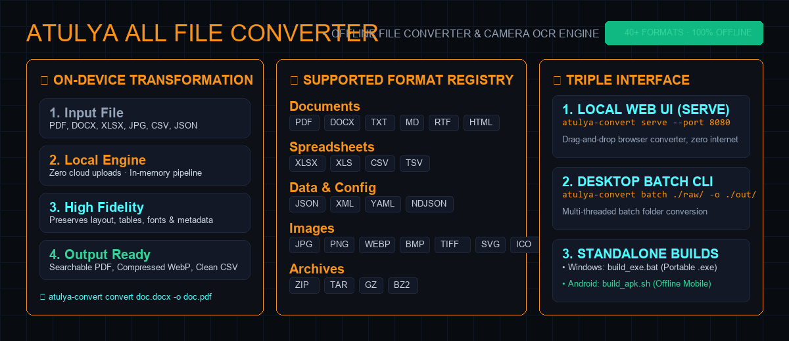

<!-- Hero Banner -->
<div align="center">
  
</div>

<div align="center">
  <h1>
    
  </h1>
</div>

<p align="center">
  <em><strong>अतुल्य</strong> (Atulya) — Sovereign privacy on your device</em><br/>
  <strong>Cross-platform offline file converter and toolkit: convert 40+ formats, batch convert directories, run a local web GUI, and build standalone desktop/mobile packages with zero data leaves your machine.</strong>
</p>

<p align="center">
  <a href="LICENSE"></a>
  <a href="https://python.org"></a>
  <a href="#"></a>
  <a href="#"></a>
  <a href="#"></a>
  
</p>

```
 ┌─────────────────────────────────────────────────────────────────────────────┐
 │                      ATULYA ALL FILE CONVERTER PIPELINE                     │
 ├─────────────────────────────────────────────────────────────────────────────┤
 │   📁 Input (Documents, Images, Tables, Data)                                │
 │                         │                                                   │
 │                         ▼                                                   │
 │   ⚡ Engine (Core Conversion Engine · 40+ Formats · Zero Cloud Calls)        │
 │                         │                                                   │
 │         ┌───────────────┼───────────────┬───────────────┐                   │
 │         ▼               ▼               ▼               ▼                   │
 │   🖥️ Terminal CLI   🌐 Local Web UI   📦 Windows EXE  📱 Android APK       │
 │   (atulya-convert)  (Built-in Serve)  (build_exe.bat) (build_apk.sh)        │
 └─────────────────────────────────────────────────────────────────────────────┘
```

---

## ⚡ Quick Start

### Installation

```bash
# Clone the repository
git clone https://github.com/atulyaai/Atulya-All-File-Converter.git
cd Atulya-All-File-Converter

# Install dependencies and CLI
pip install -e .
```

Verify installation:
```bash
atulya-convert --help
```

---

## 🚀 Key Interfaces

### 1. 🖥️ Command-Line Interface (`atulya-convert`)

```bash
# Convert between any supported formats
atulya-convert convert document.docx -o document.pdf
atulya-convert convert data.xlsx -o data.csv
atulya-convert convert picture.png -o picture.webp --quality 85

# Batch convert an entire folder
atulya-convert batch ./input_images/ -o ./output/ --format webp

# Inspect file schema and metadata
atulya-convert info report.pdf --all

# Verify file integrity
atulya-convert hash backup.zip --algo sha256

# Split and merge files
atulya-convert split big_dataset.csv --chunk 10MB
atulya-convert merge "part_*.csv" -o combined.csv

# Diff two structured files
atulya-convert diff config_v1.json config_v2.json
```

### 2. 🌐 Local Offline Web UI (`serve`)

Run your own private browser-based converter with drag-and-drop:

```bash
atulya-convert serve --port 8080 --open-browser
```
Opens a modern dark-glass web converter at `http://localhost:8080`. No internet required.

---

## 📦 Standalone Builds

Pre-configured build scripts for standalone distributables:

| Target | Build Script | Output |
|---|---|---|
| **Windows** | `build_exe.bat` | Single standalone `.exe` (PyInstaller) |
| **Android** | `build_apk.sh` | On-device Android conversion package |
| **Linux** | `build_linux.sh` | Portable binary executable |

---

## 📑 Supported Formats (40+)

To see the live registry of all supported formats and engines on your machine:
```bash
atulya-convert list
```

- **Documents**: PDF, DOCX, TXT, MD, RTF, HTML
- **Spreadsheets & Data**: XLSX, XLS, CSV, TSV, JSON, XML, YAML
- **Images**: JPG, PNG, WEBP, BMP, TIFF, GIF, ICO, SVG
- **Archives**: ZIP, TAR, GZ, BZ2

---

## 🔒 Privacy Guarantee

- **100% Offline**: All parsing and transformations occur in local process memory.
- **Zero Telemetry**: No logs or files are transmitted outside your device.

---

## 📜 License

MIT License. Copyright (c) 2026 Atulya AI.
